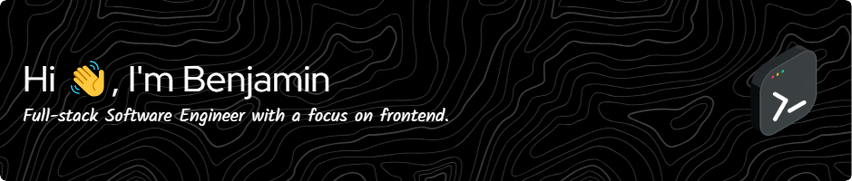

  

- 🔭 I’m currently working on midnight, a chatgpt wrapper for creating short-form content from scripts. Public release soon... 👀

- 🌱 I’m currently learning **Next.js, tRPC**

- 👨‍💻 All of my projects are available at [benjaminwilliams.xyz](https://benjaminwilliams.xyz)

- 💬 Ask me about **React**

- 📫 How to reach me **benjaminwilliamswork6@gmail.com**

- ⚡ Fun fact **I got a Senior Engineer to say "Skibidi Toliet" one time 💀**

<h3 align="left">Connect with me:</h3>

<h3 align="left">Languages and Tools:</h3>

 
   
   
   
   
   
   
   
   
   
   
   
   
   

